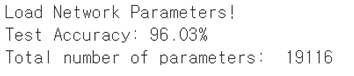

# googlenet을 이용하여 가~하 한글 분류하기

한글 가~하 까지 분류하는 모델 만들기

googlenet 구조를 변경하여 파라미터의 개수를 줄이고, 분류 정확도를 올리기. 
> 보조 분류기(auxiliary classifier)는 사용하지 않음

구조는 32*32 이미지를 잘 인식할 수 있도록 채널 수 변경 및 inception 채널 구조 변경과 일부 drop

> 원래 160,000개 정도였던 모델의 파라미터를 11916개로 줄임

### 모델 학습 시 정확도

### test set을 이용한 정확도

> 일반화가 잘 된 정확도 약 95%를 가진 모델 제작 완료
